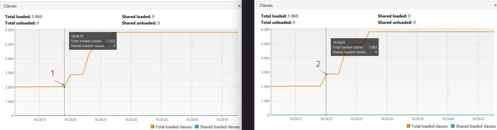
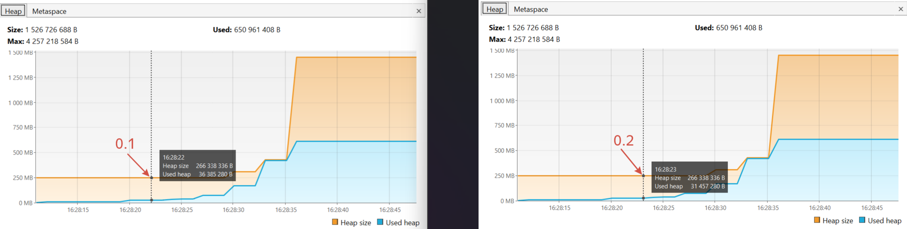

### Вывод консоли:

*красным цветом обозначено соответствие с графиками VisualVM и точками на них.

### График Classes

В точке 1 началась загрузка классов из пакета io.vertx, в точке 2 она завершилась. Было 2 053 класса, стало - 2 883. Время в точке 1 соответствует времени загрузки пакета io.vertx в окне консоли - 16:28:19.

В точке 3 началась загрузка классов из пакета io.netty, в точке 4 она завершилась. Было 2 883 класса, стало - 4 965. Время в точке 3 соответствует времени загрузки пакета io.netty в окне консоли - 16:28:22.

В точке 5 началась загрузка классов из пакета org.springframeworkx, в точке 6 она завершилась. Было 4 970 класса, стало - 5 863. К концу работы программы дозагрузка до 5 869. Время в точке 5 соответствует времени загрузки пакета org.springframeworkx в окне консоли - 16:28:26.

### График Metaspace

Классы загружаются в метаспейс, что видно на его графике.

Точка 1 соответствует моменту начала загрузки, т.е. там еще пусто, размер хранилища 0. В точке 2, которая соответствует окончанию загрузки, видно, что размер метаспейса увеличился:
- используемый объем составляет 15 233 816 В;
- общий объем - 15 859 712 В.

В точке 3 начинается загрузка следующего пакета, в 4 - заканчивается. Размер используемого объема метаспейса увеличивается с 15 233 816 В в точке 3 до 21 114 208 В в точке 4. Общий объем с 15 859 712 В до 21 889 024 В соответственно.

В точке 5 начинается загрузка следующего пакета, в 6 - заканчивается. Размер используемого объема метаспейса увеличивается с 21 114 208 В в точке 5 до 32 601 344 В в точке 6. Общий объем с 21 889 024 В до 33 423 360 В соответственно.

### График Heap

Во время загрузки классов в хипе лишь небольшая фоновая активность, его размер плавно и незначительно увеличичвается, в какой-то момент времени даже можно заметить, что сработал сборщик мусора (занимаемый объем сократился с 36 MB до 31 MB):

В точке 1 (тайминг 16:28:29) происходит резкий скачок, это совпало с началом процесса создания объектов (тайминг в консоли 16:28:29). В точке 2 объекты созданы, произошло увеличение используемой памяти и общего объема кучи.
- используемый объем хипа в точке 1 был 85 983 232 В, в точке 2 стал 187 695 104 В;
- общий объем кучи в точке 1 был 266 338 336 В, стал - 330 301 472 В. 

В точке 3 (тайминг 16:28:32) происходит резкий скачок, это совпало с началом следующего этапа создания объектов (тайминг в консоли 16:28:32). В точке 4 объекты созданы, произошло увеличение используемой части кучи и ее общего объема. 
- используемый объем хипа в точке 3 был 187 695 104 В, в точке 4 стал 446 373 888 В;
- общий объем кучи в точке 3 был 330 301 472 В, стал - 458 227 744 В. 

Общий объем кучи увеличился непропорционально росту используемой памяти, поэтому на следующей стадии создается гораздо больший объем запаса.

В точке 5 (тайминг 16:28:35) снова происходит скачок, что совпадает с началом последнего этапа создания объектов (тайминг в консоли 16:28:35). В точке 6 объекты созданы, произошло увеличение используемой памяти и общего объема кучи. 
- используемый объем хипа в точке 5 был 446 373 888 В, в точке 6 стал 649 912 832 В;
- общий объем кучи в точке 5 был 458 227 744 В, стал - 1 526 726 688 В. 

Горизонтальные участки 2-3 и 4-5 на всех графиках (Classes, Metaspace и Heap) соответствуют перерывам в работе программы, которые были вызваны командой Thread.sleep(3_000).

